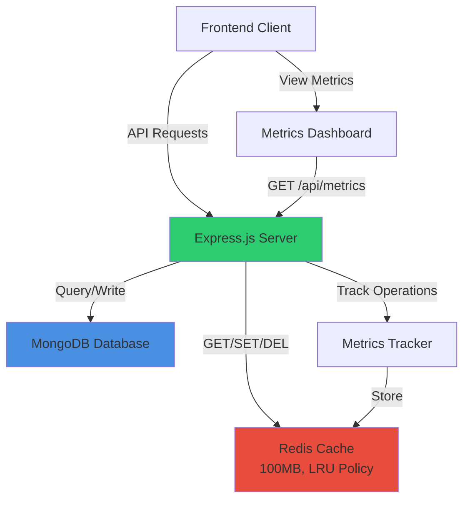
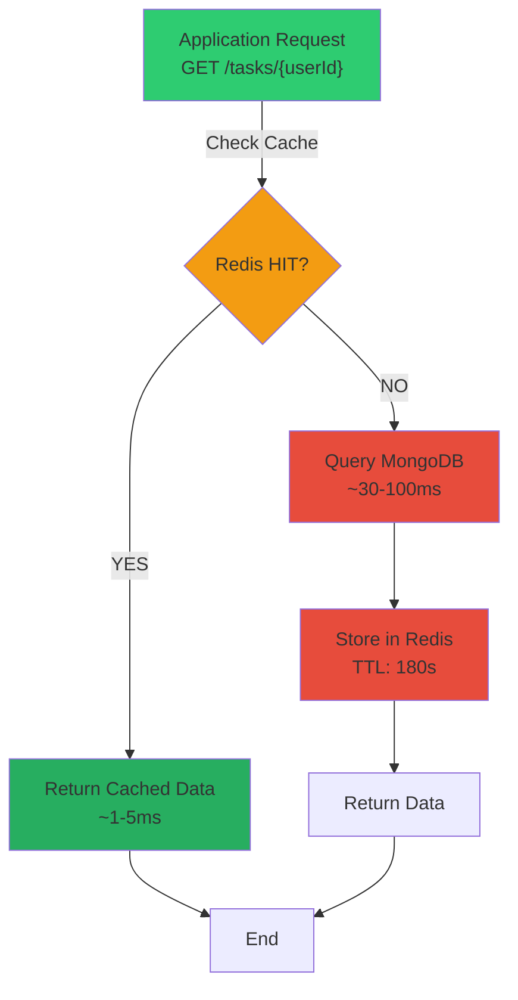
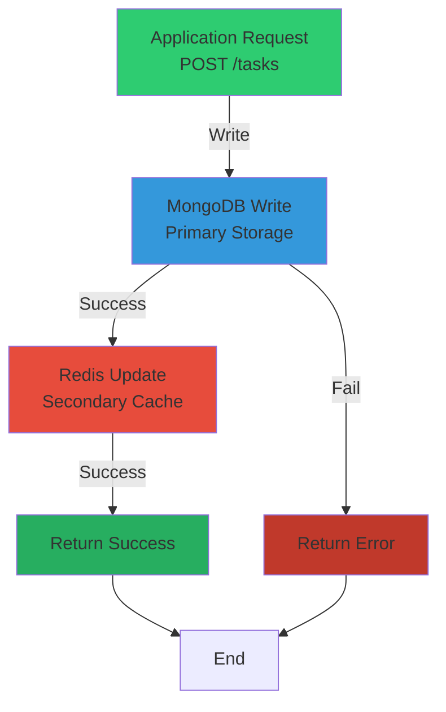
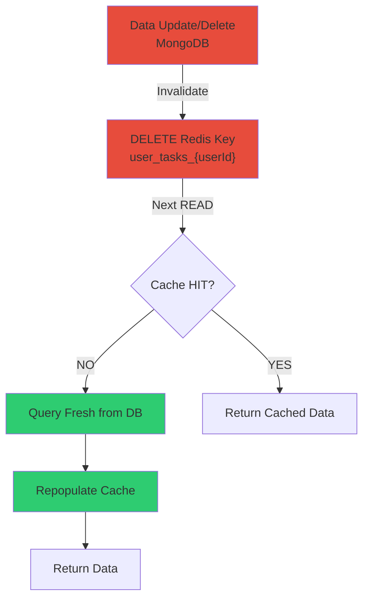
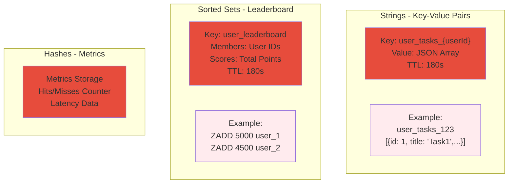
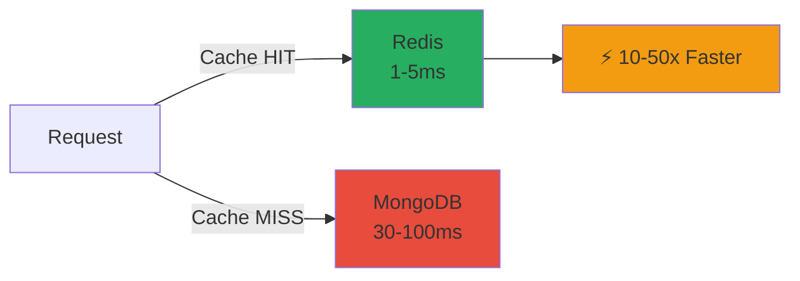
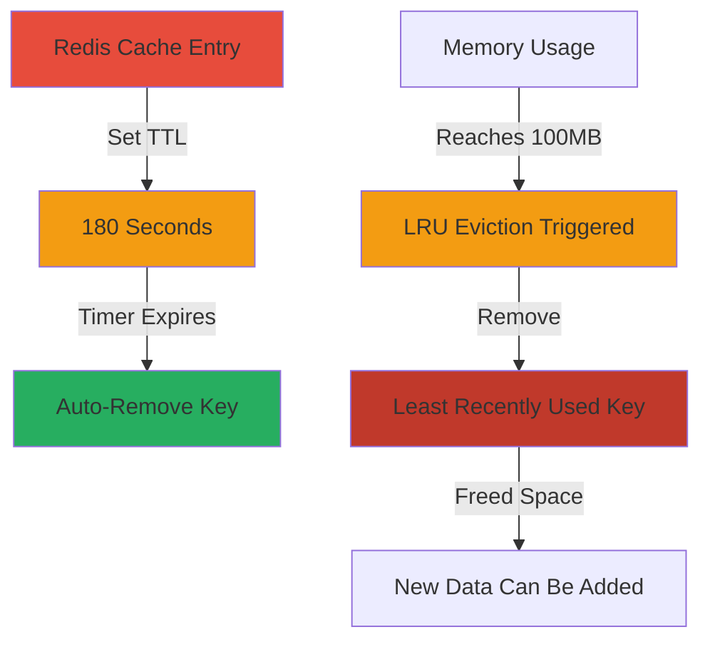
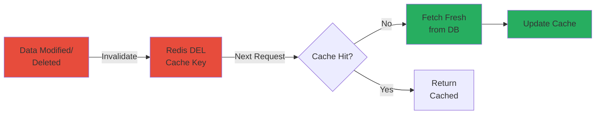
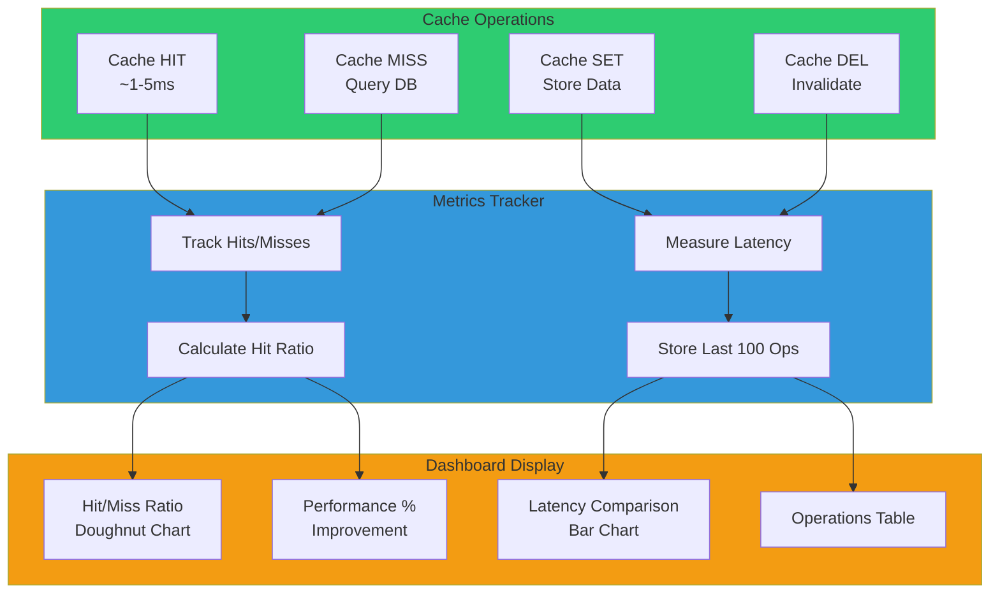

# T4 – Caching and Data Acceleration with Redis

## Overview

Redis-based caching layer to accelerate MongoDB queries. Demonstrates cache-aside, write-through strategies, and real-time performance monitoring.

### System Architecture



---

## Caching Layer Implementation

**Purpose**: Accelerate frequent MongoDB queries (user task lists, leaderboards)  
**Architecture**: Express.js application → Redis cache → MongoDB database  
**Performance Gain**: 10-50x faster (cache: ~1-5ms vs database: ~30-100ms)  
**Integration**: Transparent caching layer; application checks Redis before MongoDB

---

## Cache Strategies

### 1. Cache-Aside (Lazy Loading)



**How it works**:
1. Application checks Redis for cached data
2. **Cache HIT**: Return data immediately (~1-5ms)
3. **Cache MISS**: Query MongoDB → store in Redis → return data
4. Subsequent requests hit cache until TTL expires (180s)

**Redis Operations**:
- `GET user_tasks_{userId}` - Check cache
- `SET user_tasks_{userId} {data} EX 180` - Store with TTL

**Implementation**: [task.controller.js#L36-L58](backend/src/controllers/task.controller.js#L36-L58)

### 2. Write-Through (Synchronous Write)



**How it works**:
1. Write data to MongoDB (primary storage)
2. Immediately write to Redis (secondary cache)
3. Both operations succeed together; ensures synchronization

**Redis Operations**:
- `GET user_tasks_{userId}` - Fetch existing cache
- `SET user_tasks_{userId} {updated_data} EX 180` - Update cache

**Implementation**: [task.controller.js#L14-L33](backend/src/controllers/task.controller.js#L14-L33)

### 3. Cache Invalidation



**How it works**:
1. Update or delete data in MongoDB
2. Immediately delete Redis cache key
3. Next read triggers cache MISS → fresh data fetched

**Redis Operations**:
- `DEL user_tasks_{userId}` - Remove stale cache
- Smart invalidation: Only clears if data actually changed

**Implementation**: [task.controller.js#L59-L94](backend/src/controllers/task.controller.js#L59-L94)

---

## Redis Data Structures



### Strings (Key-Value)
**Use case**: Cache JSON arrays of MongoDB documents  
**Key pattern**: `user_tasks_{userId}`  
**Value**: JSON-stringified task list  
**TTL**: 180 seconds  
**Operations**: `GET`, `SET`, `DEL`

### Sorted Sets (Rankings)
**Use case**: Cache leaderboard rankings  
**Key**: `user_leaderboard`  
**Members**: User IDs ranked by score (total points)  
**TTL**: 180 seconds  
**Operations**: `ZADD`, `ZRANGE`, `DEL`  
**Special**: Caches ranking order only; points fetched fresh

---

## Cache Performance Metrics



**What's tracked**:
- Cache hits and misses (per operation type)
- Latency for each operation (milliseconds)
- Hit ratio: `(Hits / Total Requests) × 100`
- Latency improvement: `((DB_Time - Cache_Time) / DB_Time) × 100`

**Metrics collection**: [metricsTracker.js](backend/src/utils/metricsTracker.js)  
**API endpoint**: `GET /api/metrics`  
**Storage**: Last 100 operations in memory

---

## Memory Management



### TTL (Time-To-Live)
**Configuration**: 180 seconds on all cache keys  
**Behavior**: Redis automatically expires and removes old keys  
**Benefit**: Prevents indefinite stale data; forces periodic refresh

### LRU Eviction Policy
**Configuration** ([app.js#L20-L21](backend/src/app.js#L20-L21)):
```javascript
await redisClient.configSet('maxmemory', '100mb');
await redisClient.configSet('maxmemory-policy', 'allkeys-lru');
```

**Behavior**:
- Max memory: 100MB
- When limit reached: Remove least recently used keys automatically
- Frequently accessed data stays in cache

---

## Cache Invalidation Policies



**On data deletion**: `DEL` cache key immediately  
**On data update**: `DEL` cache key; next read repopulates  
**Smart invalidation**: Leaderboard only invalidates if ranking order changes  
**Timing**: Synchronous (immediate) after MongoDB write  
**Guarantee**: No stale cache after modifications

---

## Metrics Dashboard



**Access**: `http://localhost:3000/metrics-dashboard`  
**Implementation**: [CacheMetrics.html](frontend/CacheMetrics.html)

**Displays**: Hit ratio, total hits/misses, average latencies, performance improvement percentage  
**Visualizations**: Doughnut chart (hit/miss distribution), bar chart (latency comparison), operations table  
**Features**: Real-time updates with Chart.js, manual refresh and clear buttons